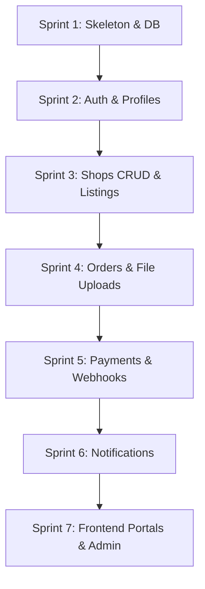

# PrintKarDoBhaiya — Project Plan & Tasks

This file tracks the project plan, tasks to do, work remaining, and work done. It serves as the backlog, sprint schedule, and tracking document for the development of **PrintKarDoBhaiya**.

---

## 1. Project Overview & Scope
PrintKarDoBhaiya is a hyperlocal document printing marketplace connecting students with local print shops.
- **V1 Scope (MVP):** File upload, spec selection, shop selection (only open shops), Razorpay payment, order dashboard, status updates (Placed → Accepted/Rejected → Printing → Ready → Collected), and Email/WhatsApp notifications.
- **Out of Scope for V1:** Delivery/couriers, platform transaction fees (₹0 platform fee at launch), in-app chat, native mobile apps (responsive web only), multiple payment gateways, and automated refunds.

---

## 2. Work Done

The initial planning and specification phase is **100% Complete**. The workspace currently contains the entire architectural and design specification for the platform:

### Core Documentation Set
1. **Master PRD (`00_MASTER_PRD.md`):** Defines the product requirements, user roles (Student, Shopkeeper, Super Admin), launch strategy, growth tactics, and risk management.
2. **System Design & Architecture (`01_SYSTEM_DESIGN_ARCHITECTURE (1).md` & `06-ARCHITECTURE.md`):** Identifies the tech stack, data flow diagrams, system components, and scaling triggers.
3. **Database Design (`02_DATABASE_DESIGN.md`):** Defines the PostgreSQL ERD, model schema specifications, database index strategy, and data management policy (soft delete, backups).
4. **Cybersecurity & Payment Safety (`03_CYBERSECURITY_PAYMENT_SAFETY.md`):** Defines threat models, JWT authentication, session control, role-based access control, file upload security, and Razorpay signature verification.
5. **Security Audit & Hardening (`04_SECURITY_AUDIT_HARDENING_PLAN.md`):** A pre-launch security checklist, testing methods (IDOR, webhook signature, price tampering), self-audit cadence, and a post-launch hardening roadmap.
6. **API, Coding & Hosting Guide (`07-API-CODING-GUIDE.md`):** Details the Django app structure, models, API endpoints, Gunicorn/Render hosting config, and Vercel frontend config.
7. **Frontend Specification (`08-FRONTEND-SPEC.md`):** Specifies the React (Vite) pages, routes, multi-step ordering flow, dashboard actions, components, and UX principles.
8. **SEO & Business Feature Roadmap (`09-SEO-AND-BUSINESS.md`):** Outlines SEO optimization, organic traffic acquisition, and future monetization triggers.
9. **Work Log & Decision History (`10-WORK-LOG.md`):** Historical log of design and stack choices (e.g., choice of PostgreSQL over MongoDB, ₹0 platform fee, sync notifications for V1).
10. **README (`11-README.md`):** High-level overview of the product, user flow, and document mapping.

*Note: No application code (backend or frontend) has been written yet. Development begins with Sprint 1.*

---

## 3. Planning & Sprint Schedule

To build the platform efficiently without introducing bugs, the development will be divided into **7 sequential sprints**:



### Sprint Timeline Estimation
- **Sprint 1:** Backend Skeleton, Database Configuration, and Core Utilities.
- **Sprint 2:** User Accounts & Authentication (Students, Shopkeepers, Admins).
- **Sprint 3:** Shop Management, Profile Setup, and Pricing Lists.
- **Sprint 4:** Order Creation, File Uploads (Cloudinary/S3 Integration), and Status Logs.
- **Sprint 5:** Razorpay Checkout Integration, Webhook Verification, and Refund API.
- **Sprint 6:** Notification Delivery Service (Brevo SMTP & WhatsApp APIs).
- **Sprint 7:** Frontend Portal UI (React) and Customized Django Admin Panel.

---

## 4. Work To Do (Actionable Tasks)

This backlog lists the tasks required to implement the MVP. 

### Sprint 1: Django Skeleton & Database Setup
- [ ] Initialize Django project with `config` and separate apps (`accounts`, `shops`, `orders`, `payments`, `notifications`, `core`).
- [ ] Configure `requirements.txt` with Django, DRF, JWT (`djangorestframework-simplejwt`), `dj-database-url`, `psycopg2-binary`, `cloudinary`, `razorpay`, etc.
- [ ] Set up PostgreSQL (Supabase or Neon) and connect the Django settings via `DATABASE_URL`.
- [ ] Configure settings for Environment Variables using `django-environ` (create `.env.example`).
- [ ] Configure Gunicorn, static files hosting config, and set up Render deployment configs.

### Sprint 2: Accounts, Authentication & Roles
- [ ] Implement `User` model in `accounts/models.py` (inheriting from `AbstractUser`) with a `role` field (`student`, `shopkeeper`, `admin`).
- [ ] Implement JWT token authentication endpoints (`/api/v1/auth/login/`, `/api/v1/auth/token/refresh/`).
- [ ] Implement Student register endpoint (`/api/v1/auth/register/student/`).
- [ ] Implement Shopkeeper register endpoint (`/api/v1/auth/register/shopkeeper/`) with an `is_approved=False` flag.
- [ ] Write custom DRF Permission Classes (`IsStudent`, `IsShopOwner`, `IsSuperAdmin`).
- [ ] Create email-verification logic and templates for signup validation.

### Sprint 3: Shops & Profiles
- [ ] Implement `ShopProfile` model with slug, address, location (city, area), contact numbers, availability status (`OPEN`, `CLOSED`, `HOLIDAY`), and price lists.
- [ ] Create `PriceList` and `BindingOption` models for shopkeepers to customize rates.
- [ ] Build the public shop listings endpoint (`/api/v1/shops/`) showing only approved shops and filterable by city/area/status.
- [ ] Build endpoints for shopkeepers to update profiles (`PATCH /api/v1/shops/me/`), pricing, and toggle shop status.
- [ ] Implement `ShopStatusLog` to record availability transitions.

### Sprint 4: Document Uploads & Order Lifecycle
- [ ] Set up Cloudinary or S3 file storage wrapper with signed URLs for shopkeepers and admins.
- [ ] Implement file type whitelist validation (PDF, DOCX, DOC, JPG, PNG) and file size checks (max 20-30MB) server-side.
- [ ] Build `Order` and `OrderFile` models including specs (color mode, copies, single/double sided, binding).
- [ ] Build the pricing logic in `orders/services.py` to calculate order cost server-side (snapshots rates in `Order.price_breakdown` JSON and `total_amount`).
- [ ] Build order creation endpoint (`POST /api/v1/orders/`) which calculates price, verifies shop is open, uploads file, and creates the order in a `pending_payment` state.
- [ ] Create `OrderStatusHistory` model and write a service that handles all transitions safely (blocking illegal transitions).
- [ ] Implement endpoints for shopkeepers to transition orders: `Accept/Reject`, `Mark Printing`, `Mark Ready`, and `Mark Collected`.

### Sprint 5: Payments (Razorpay Integration)
- [ ] Implement Razorpay order creation on the backend when a student places a print job.
- [ ] Implement payment verification endpoint (`POST /api/v1/payments/verify/`) using Razorpay's Python SDK signature verification.
- [ ] Build the Razorpay webhook endpoint (`POST /api/v1/payments/webhook/`) to handle asynchronous payment success notification (verify signature, idempotency check, mark order `placed`).
- [ ] Create the `Payment` model to track Razorpay identifiers (`razorpay_order_id`, `razorpay_payment_id`, `razorpay_signature`) and payment status (`created`, `success`, `failed`, `refunded`).
- [ ] Implement the manual refund flow trigger via Razorpay's refund API for rejected orders.

### Sprint 6: Multichannel Notifications
- [ ] Design the generic `NotificationService` interface to support easy provider swapping.
- [ ] Integrate SMTP using Brevo to send transactional emails (New Order, Order Accepted, Order Ready, Verification).
- [ ] Integrate Meta WhatsApp Cloud API or Gupshup. Submit templates for approval (Order Placed, Order Ready, Shop Status Reminders).
- [ ] Set up Django signals to trigger email/WhatsApp notifications on Order status transitions.
- [ ] Build the `NotificationLog` and `InAppNotification` feed systems.

### Sprint 7: React Frontend & Custom Admin Panel
- [ ] Bootstrap the React app using Vite, configure React Router and Axios client with interceptors for JWT.
- [ ] Build Public Pages: Landing Page (`/`), Login (`/login`), and Signups.
- [ ] Build Student Portal: Dashboard (`/student/dashboard`), Multi-step Order Flow (File Upload → Specs → Shop Select → Review & Razorpay Checkout), Order History & Stepper Tracking (`/student/orders/<order_id>`).
- [ ] Build Shopkeeper Portal: Dashboard with Open/Closed toggle and status summary, Order Queue lists with quick-status actions (Accept/Reject, Mark Printing, Mark Ready, Collected), Profile, and Pricing Editors.
- [ ] Customize Django Admin Panel (`adminpanel/admin.py`) for Super Admin needs: dashboard statistics, shop approval list, transaction logs, and manual override actions.
- [ ] Deploy frontend to Vercel and backend to Render, configuring database links and CORS headers.

---

## 5. Work Remaining

The entire implementation phase remains to be executed. Below is a high-level summary of the phases remaining:

```
┌──────────────────────────────┐
│  Phase 1: Database & Backend │  ---> 0% Complete (Work To Do)
└──────────────┬───────────────┘
               ▼
┌──────────────────────────────┐
│  Phase 2: React Frontend UI  │  ---> 0% Complete (Work To Do)
└──────────────┬───────────────┘
               ▼
┌──────────────────────────────┐
│  Phase 3: Integration & QA   │  ---> 0% Complete (Work To Do)
└──────────────┬───────────────┘
               ▼
┌──────────────────────────────┐
│  Phase 4: Security & Launch  │  ---> 0% Complete (Work To Do)
└──────────────────────────────┘
```

1. **Backend API Development:** Core logic, models, authentication, state machine transitions, and database migrations.
2. **Third-Party Integrations:** Cloudinary file upload, Razorpay checkout and webhooks, Brevo SMTP email delivery, and WhatsApp Business API.
3. **Frontend Application Development:** User portals, multi-step order flow, interactive responsive dashboards, and client-side styling.
4. **Testing, Verification & Security Auditing:** IDOR manual testing, signature verification checks, file type whitelist bypassing tests, and loading/throttling confirmation.
5. **Hosting & Production Deployment:** Render deployment, Supabase/Neon Postgres configuration, Vercel deployments, custom domains, and SSL setups.
